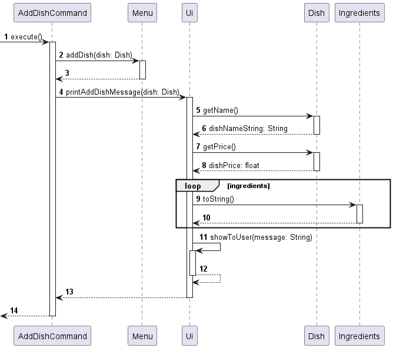

# Developer Guide

## Acknowledgements

{list here sources of all reused/adapted ideas, code, documentation, and third-party libraries -- include links to the original source as well}

## Design & implementation

*Figure X: Execution of add_dish command*

API: [AddDishCommand.java](https://github.com/AY2324S1-CS2113-T17-2/tp/blob/master/src/main/java/seedu/cafectrl/command/AddDishCommand.java)

The `add_dish` command, add a dish to the `Menu` object and prints out a formatted message to state the name, price and ingredients entered for the dish.

when the `execute()` method from `AddDishCommand` is called in the main class `CafeCtrl`, the `addDish()` method is first called to add the `Dish` object to the `Menu`. It will then call the `printAddDishMessage()` method, which gets all the parameters of the `Dish` object (dishName, dishPrice, dishIngredients) and passes them to the `Ui` to then be printed out to the User.

Separation of Concerns was applied to ensure the `Ui` is only responsible with only displaying messages while the `Menu` deals with the logic of adding dish to the menu. This implementation also encapsulates the details of adding a dish and displaying messages. For example, The `AddDishCommand` class doesn't need to know how the internal details of the dish adding and message printing are performed.

## Product scope
### Target user profile

{Describe the target user profile}

### Value proposition

{Describe the value proposition: what problem does it solve?}

## User Stories

|Version| As a ... | I want to ... | So that I can ...|
|--------|----------|---------------|------------------|
|v1.0|new user|see usage instructions|refer to them when I forget how to use the application|
|v2.0|user|find a to-do item by name|locate a to-do without having to go through the entire list|

## Non-Functional Requirements

{Give non-functional requirements}

## Glossary

* *glossary item* - Definition

## Instructions for manual testing

{Give instructions on how to do a manual product testing e.g., how to load sample data to be used for testing}
