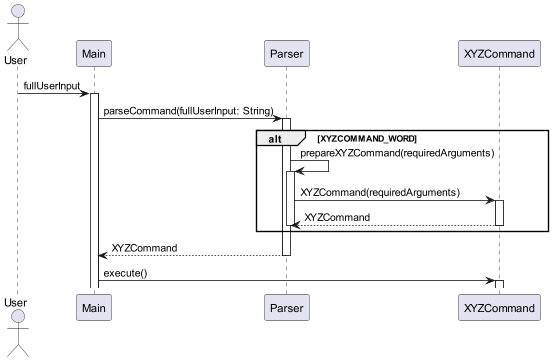
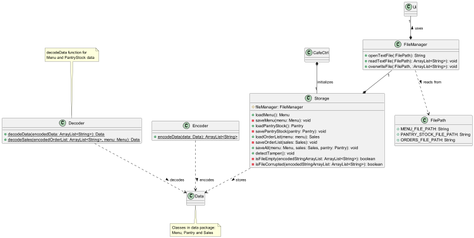
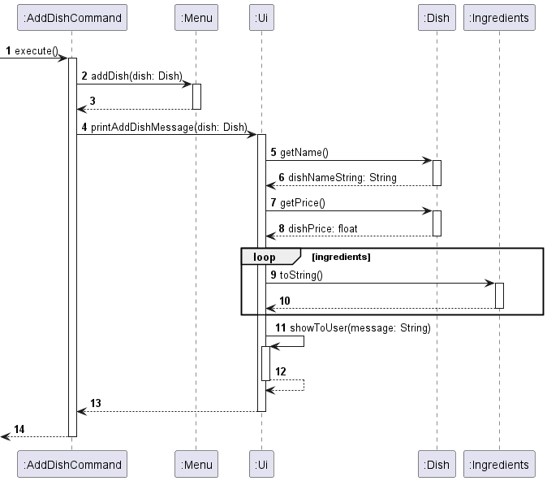
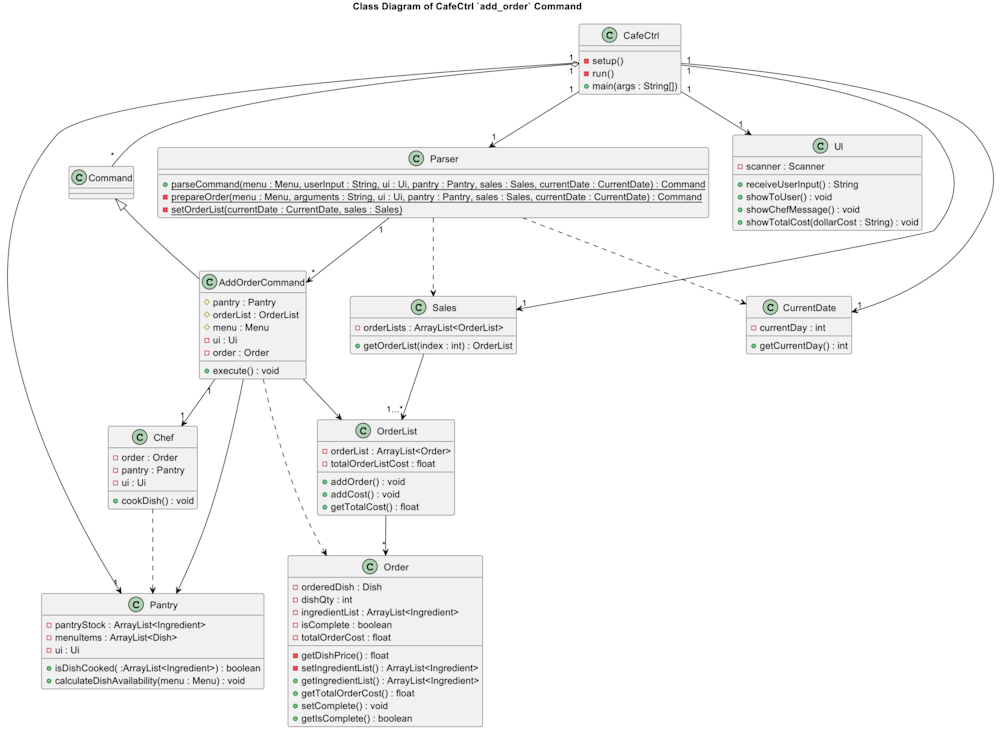

# Developer Guide

## Acknowledgements

{list here sources of all reused/adapted ideas, code, documentation, and third-party libraries -- include links to the original source as well}

## Design

### Parser
API: [Parser.java]({repoURL}src/main/java/seedu/cafectrl/parser/Parser.java)

*Figure 1: Parser Class Diagram*

Note that `CafeCtrl` only have access to the interface `ParserUtil` although the run-time type object is `Parser`. With this, we are able to decrease coupling between `CafeCtrl` and `Parser`, allowing for easier maintenance. This also ensures the testability as we could provide mock or stub dependencies during testing, we could isolate the behavior of the class and focus on unit testing without external dependencies. 

*Figure 2: Parser Parsing User Input Sequence Diagram*

When user input a string to `Main`,  it passes the full user input to `Parser` via `parseCommand`. In `parseCommand`,  it finds the matching keyword for different command from the user input, then it calls the respective `prepareCommand` method within `Parser`. `prepareCommand` then generates the corresponding command class and return it to `parseCommand`, which returns the `Command` back to `Main` for execution.

### Storage
API: [Storage.java]({repoURL}src/main/java/seedu/cafectrl/storage/Storage.java)

*Figure 3: Storage Class Diagram*

The `Storage` class,
- loads and saves the list of dishes on the `Menu`, available ingredient stock in `Pantry` and orders for the day in `OrderList` in a text file.
- depends on `Menu`, `Pantry` and `Sales` objects (which are found in the data package).
- is composed of `FileManager` object as the text file needs to be located first before reading or writing.

## Features

### Add Dish

*Figure X: Execution of add_dish command*

API: [AddDishCommand.java](https://github.com/AY2324S1-CS2113-T17-2/tp/blob/master/src/main/java/seedu/cafectrl/command/AddDishCommand.java)

The `add_dish` command, add a dish to the `Menu` object and prints out a formatted message to state the name, price and ingredients entered for the dish.

when the `execute()` method from `AddDishCommand` is called in the main class `CafeCtrl`, the `addDish()` method is first called to add the `Dish` object to the `Menu`. It will then call the `printAddDishMessage()` method, which gets all the parameters of the `Dish` object (dishName, dishPrice, dishIngredients) and passes them to the `Ui` to then be printed out to the User.

Separation of Concerns was applied to ensure the `Ui` is only responsible with only displaying messages while the `Menu` deals with the logic of adding dish to the menu. This implementation also encapsulates the details of adding a dish and displaying messages. For example, The `AddDishCommand` class doesn't need to know how the internal details of the dish adding and message printing are performed.

### Adding a Dish

### List Menu
A `list_menu` command can be used to display all the `Dish` objects stored in `Menu`.

The following class diagram illustrates the relationship between the respective classes involved in the creation and execution of a list_menu command.

Figure 1: Execution of list_menu command

API: [ListMenuCommand.java]({repoURL}src/main/java/seedu/cafectrl/command/ListMenuCommand.java)

When the `execute()` method of ListMenuCommand is invoked in Main, it checks if the size of the menu by running `menu.getSize()`. 

1) If the menu is empty, it will call its `printEmptyMenu()` method to display to the user a `MENU_EMPTY_MESSAGE` in the Ui object and returns afterward.
2) If the menu is not empty, it will call its `printFullMenu()` method.
`printFullMenu()` will first print the top portion of the menu using the Ui object. 
It then iterates through the `Dish` objects in `Menu` in a "for" loop, using `menu.getDishFromId()` to retrieve the Dish object.
The `dishName` and `dishPrice` are both access from `Dish` Class using `getName()` and `getPrice()` respectively.
The data are then packaged nicely in a `leftAlignFormat`, with (indexNum + ". " + dishName," $" + dishPrice) such that
   e.g. (1. Chicken Rice $2.50) is shown.

### Add Order
A add_order command can be used to add `order` to an `orderList` in `Sales`.

The following class diagram illustrates the relationship between the respective classes involved in the creation and execution of an add_order command.

Figure 2: Execution of add_order command

API: [AddOrderCommand.java]({repoURL}src/main/java/seedu/cafectrl/command/ListMenuCommand.java)

When the `execute()` method of AddOrderCommand is invoked in Main, the parsed `order` object is added to the `orderList`.

A `Chef` object is then created to process the order by running `cookDish()`. 
This method first checks if the order has already been completed by running `order.getIsCompleted()`.
If the order has not been completed, the `showDeleteMesage()` in the Ui component is triggered to display a message to show the user that the dish is being 'prepared'.
An ArrayList of Ingredients, ingredientList, is retrieved from the `order` object by `order.getIngredientList()`. 
This ingredientList is passed into the `pantry` object in `pantry.decreaseIngredientsStock()` to process the ingredients used from the pantry stock.
The order is then marked as completed by `order.setComplete()`

Returning to the AddOrderCommand, the `order` object is checked to be completed again by running `order.getIsCompleted()`.
This verifies that the ingredientList has been successfully retrieved and passed into `pantry.decreaseIngredientsStock()` to run without errors.
After verifying that the order has been completed, the cost of the order is added to the total order by `orderList.addCost()`. 

The total sum of orders in the `orderList` object is retrieved using `orderList.getTotalCost()`.
This is then passed into Ui using `ui.showTotalCost()` to display a message to the user with the total order cost.

### Next Day
A `next_day` command can be used advance the current day.

The following class diagram illustrates the relationship between the respective classes involved in the creation and execution of a next_day command.

Figure 3: Execution of next_day command

API: [NextDayCommand.java]({repoURL}src/main/java/seedu/cafectrl/command/ListMenuCommand.java)

When the `execute()` method of NextDayCommand is invoked in Main, the day in the program is advanced by 1 day, by running `currentDate.nextDay()`.

The next day data is retrieved from the `CurrentDate` object using `currentDate.getCurrentDay()`.
This next day data is compared with the days accounted for in the `Sales` object, retrieved using `sales.getDaysAccounted()`.

If the next day is more than the number of days accounted in sales, this means that there is no `orderList` prepared for the coming day.
A new `OrderList` object is created using `new OrderList()`, and added into the `Sales` object by running `sales.addOrderList()`.
Following this, the day has been accounted and this is updated through `sales.nextDay()`.

To end off the command, `ui.showNextDay()` is run to display a message to the user a prepared message for advancing the day.
The user is also shown the advanced day number.

### Previous Day
A `previous_day` command can be used to recede the current day.

The following class diagram illustrates the relationship between the respective classes involved in the creation and execution of a next_day command.

Figure 4: Execution of previous_day command

API: [PreviousDayCommand.java]({repoURL}src/main/java/seedu/cafectrl/command/ListMenuCommand.java)

When the `execute()` method of PreviousDayCommand is invoked in Main, the day in the program is receded by 1 day, by running `currentDate.previousDay()`.

To end off the command, `ui.showPreviousDay()` is run to display a message to the user a prepared message for receding the day.
The user is also shown the receded day number.

### List Ingredients

*Figure 2: Execution of list_ingredient command*

API: [ListIngredientCommand.java]({repoURL}src/main/java/seedu/cafectrl/command/ListIngredientCommand.java)

| No | Step                          | Description                                                                                                                                                                                                                                                                                                                                                                              |
|----|-------------------------------|------------------------------------------------------------------------------------------------------------------------------------------------------------------------------------------------------------------------------------------------------------------------------------------------------------------------------------------------------------------------------------------|
| 1  | Initialization                | The sequence begins with the `Main` class invoking the `execute` method of the `ListIngredientCommand` after parsing a user command.                                                                                                                                                                                                                                                     |
| 2-3  | Interaction with 'Menu'       | The `ListIngredientCommand` communicates with the `Menu` class, invoking the `getMenuItemsList()` method to retrieve a list of menu items. The function returns an ArrayList of objects of 'Dish' type.                                                                                                                                                                                  |
| 4  | Interaction with 'Ui'         | The `ListIngredientCommand` communicates with the `Ui` class, invoking the `printIngredients()` method to print out the list of ingredients used for the selected dish.   * The function returns an ArrayList of objects of 'Dish' type. The `get()` method is then invoked to get the dish of the specified index. However, this is ommitted to prevent unnecessary sophistication. |
| 5-6  | Interaction with 'Dish'       | The `Ui` class communicates with the `Dish` class, invoking the `getIngredients()` method to obtain the list of ingredients for the selected dish. The `Dish` class responds with an ArrayList of objects of 'Ingredient' type to the `Ui` class.                                                                                                                                        |
| 7-8  | Iteration through Ingredients | There is a loop that iterates through each ingredient in the list. The `Ui` class interacts with the `Ingredients` class, converting each ingredient to a string containing the ingredient and quantity needed.                                                                                                                                                                          |
| 9-10  | Display to User               | The `Ui` class showcases the information to the user through the `showToUser()` method.                                                                                                                                                                                                                                                                                                  |

### Delete Dish

 *Figure X: Execution of delete dish command

API: [DeleteDishCommand.java]({repoURL}src/main/java/seedu/cafectrl/command/DeleteDishCommand.java)

When the `execute()` method of `DeleteDishCommand` is invoked in `Main`, it subsequently calls `getMenuItemsList().get(dishIndexToBeDeleted)` method on the `Menu` object to retrieve the `Dish` object to be deleted.
Following this, the `showDeleteMesage()` method in the Ui component is triggered to display a message to show the user which dish is about to be deleted.
Afterward, `DeleteDishCommand` calls `removeDish(dishIndexToBeDeleted)` of the `Menu` object to remove the selected dish at the index indicated by the user.
This sequence of actions orchestrates the flow of information and operations between `Main`, `DeleteDishCommand`, `Menu`, and `Ui` components, ensuring the seamless handling of the dish deleting functionality within the application.

`DeleteDishCommand` is implemented in such a way because:
1. It promotes loose coupling between components. For instance, `Main` doesn't need to know the details of how the `execute()` of `DeleteDishCommand` is executed or how the message is displayed in `Ui`.
2. Each component has a specific role and responsibility. `Main` is responsible for receiving user input and invoking `execute()`, `DeleteDishCommand` is responsible for encapsulating the delete operation, `Menu` is responsible for managing the menu items, and `Ui` is responsible for displaying messages to the user. This separation of concerns makes the code more maintainable and easier to understand.

### Edit Price

*Figure 3: Execution of edit_price command*

API: [EditPriceCommand.java]({repoURL}src/main/java/seedu/cafectrl/command/EditPriceCommand.java)

When the `execute()` method of `EditPriceCommand` is invoked in `Main`, it subsequently calls the `setPrice()` method on the `Dish` object to modify the price of the specific dish. Following this, the `showEditPriceMessages()` method in the `Ui` component is triggered to retrieve and display a message from `Messages` related to the successful execution of the price modification process. This sequence of actions orchestrates the flow of information and operations between the `Main`, `EditPriceCommand`, `Dish`, and `Ui` components, ensuring the seamless handling of the price editing functionality within the application.

### Help

*figure 4: Execution of help command*

API: [HelpCommand.java]({repoURL}src/main/java/seedu/cafectrl/command/HelpCommand.java)

When the `execute()` method of `HelpCommand` is invoked in `Main`, it subsequently calls the `showHelp()` method in `Ui`. In `showHelp()`, messages related to command usage will be retrieved and be printed out using by self-invoking `showToUserWithSpaceInBetweenLines(messages: String...)`.

## Product scope
### Target user profile

{Describe the target user profile}

### Value proposition

{Describe the value proposition: what problem does it solve?}

## User Stories

|Version| As a ... | I want to ... | So that I can ...|
|--------|----------|---------------|------------------|
|v1.0|new user|see usage instructions|refer to them when I forget how to use the application|
|v2.0|user|find a to-do item by name|locate a to-do without having to go through the entire list|

## Non-Functional Requirements

{Give non-functional requirements}

## Glossary

* *glossary item* - Definition

## Instructions for manual testing

{Give instructions on how to do a manual product testing e.g., how to load sample data to be used for testing}
