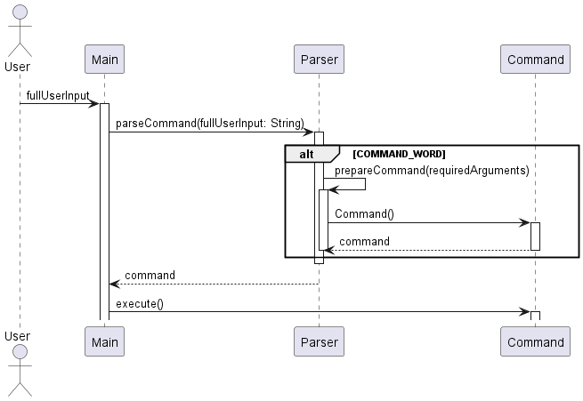
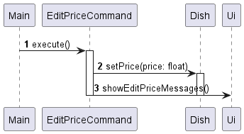

# Developer Guide

## Acknowledgements

{list here sources of all reused/adapted ideas, code, documentation, and third-party libraries -- include links to the original source as well}

## Design & implementation

## Design

### Parser

*figure 1: Parser Parsing User Input Sequence Diagram*

API: [Parser.java]({repoURL}src/main/java/seedu/cafectrl/parser/Parser.java)

When user input a string to `Main`,  it passes the full user input to `Parser` via `parseCommand`. In `parseCommand`,  it finds the matching keyword for different command from the user input, then it calls the respective `prepareCommand` method within `Parser`. `prepareCommand` then generates the corresponding command class and return it to `parseCommand`, which returns the `Command` back to `Main` for execution.

## Feature

### Delete Dish

 *Figure X: Execution of delete dish command

API: [DeleteDishCommand.java]({repoURL}src/main/java/seedu/cafectrl/command/DeleteDishCommand.java)

When the `execute()` method of `DeleteDishCommand` is invoked in `Main`, it subsequently calls `getMenuItemsList().get(dishIndexToBeDeleted)` method on the `Menu` object to retrieve the `Dish` object to be deleted.
Following this, the `showDeleteMesage()` method in the Ui component is triggered to display a message to show the user which dish is about to be deleted.
Afterward, `DeleteDishCommand` calls `removeDish(dishIndexToBeDeleted)` of the `Menu` object to remove the selected dish at the index indicated by the user.
This sequence of actions orchestrates the flow of information and operations between `Main`, `DeleteDishCommand`, `Menu`, and `Ui` components, ensuring the seamless handling of the dish deleting functionality within the application.

`DeleteDishCommand` is implemented in such a way because:
1. It promotes loose coupling between components. For instance, `Main` doesn't need to know the details of how the `execute()` of `DeleteDishCommand` is executed or how the message is displayed in `Ui`.
2. Each component has a specific role and responsibility. `Main` is responsible for receiving user input and invoking `execute()`, `DeleteDishCommand` is responsible for encapsulating the delete operation, `Menu` is responsible for managing the menu items, and `Ui` is responsible for displaying messages to the user. This separation of concerns makes the code more maintainable and easier to understand.

### Edit Price

*figure 2: Execution of edit_price command*

API: [EditPriceCommand.java]({repoURL}src/main/java/seedu/cafectrl/command/EditPriceCommand.java)

When the `execute()` method of `EditPriceCommand` is invoked in `Main`, it subsequently calls the `setPrice()` method on the `Dish` object to modify the price of the specific dish. Following this, the `showEditPriceMessages()` method in the Ui component is triggered to display a message related to the successful execution of the price modification process. This sequence of actions orchestrates the flow of information and operations between the `Main`, `EditPriceCommand`, `Dish`, and `Ui` components, ensuring the seamless handling of the price editing functionality within the application.

## Product scope
### Target user profile

{Describe the target user profile}

### Value proposition

{Describe the value proposition: what problem does it solve?}

## User Stories

|Version| As a ... | I want to ... | So that I can ...|
|--------|----------|---------------|------------------|
|v1.0|new user|see usage instructions|refer to them when I forget how to use the application|
|v2.0|user|find a to-do item by name|locate a to-do without having to go through the entire list|

## Non-Functional Requirements

{Give non-functional requirements}

## Glossary

* *glossary item* - Definition

## Instructions for manual testing

{Give instructions on how to do a manual product testing e.g., how to load sample data to be used for testing}
