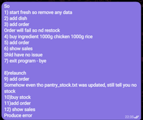
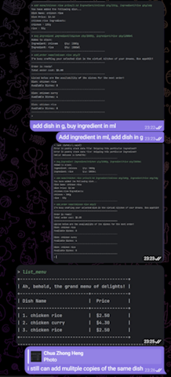
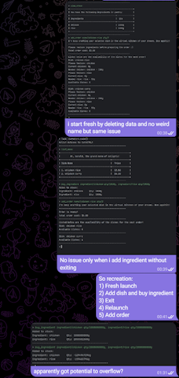

**Project: CafeCRTL**

#### **Overview**
CaféCTRL is a software engineering project for CS2113. The user interacts with the application through CLI. It has around 6 kLoC, and it is done in a team of 5.

#### **Value Proposition**
CaféCRTL aims to optimize managing of inventory and cash flow in a restaurant. Our CLI platform empowers Café proprietors to streamline inventory and menu management.

#### **Target User**
Café proprietors who prefer typing on CLI than any other interaction method and are seeking for a software solution to optimize the management of their café's operations.

### Summary of Contributions

##### Code Contribution
[Follow here to see code written by me](https://nus-cs2113-ay2324s1.github.io/tp-dashboard/?search=cazh1&breakdown=true)

#### Feature implemented

1.  **List Menu**  
    Function: Allow user to view all dishes added to menu  
    Command Format: `list_menu`
     
2.  **Add Order**  
    Function: Adds an order consisting of dishes off the menu to an order list  
    Command Format: `add_order name/DISH_NAME qty/DISH_QTY` 
    Error Handling: This command is able to detect missing argument tag, missing argument, wrong argument type, empty argument type. It will then output specific error message to prompt the user to enter the correct Command format.  
    Highlights: This feature required the creation of 5 classes to work together to perform the intended task. This really tested my understanding of OOP and planning to minimise overlap and manage the interactions between these classes.
     
3.  **Day Change Commands**  
    Added the ability to traverse through different days.  
    Function: Next Day and Previous Day commands allow the user to traverse through different days to capture sales, simulating a sales system used in a restaurant.  
    Command Format: `next_day` and `previous_day` 
    Error Handling: Next Day command ensures that the intended traversed day has a proper orderList, preventing a NullPointerException. Previous Day command will prevent the user from traversing to days before Day 1.  
    Highlights: This feature required strong understanding of ArrayLists as it worked with multiple layers of ArrayLists as well as different copies of the same ArrayList that needed to be synchronised.  
     
4.  **Hashing text save files**  
    Implemented Hashing for text files used to save app user input data.  
    What it does: Hashes the text files generated from user actions (such as Menu, Sales and PantryStock), that will be accessed to load relevant data back into the application. When tampering has been detected, the syntax is shown to the user to ensure that the user is able to adjust the data saved while maintaining the format that the application is able to process. 
    Justification: This was done to detect tampering of these save files which may potentially crash or induce unexpected behaviour from the application when the data is read and loaded into the application.  
    Highlights: This feature relied on knowledge learnt in CS2040C, Data Structures and Algorithms, to come up with the idea, understand how hashing works and how to implement this feature. 
    Credits: https://www.geeksforgeeks.org/java-string-hashcode-method-with-examples/  
    Implemented in PRs: [#283](https://github.com/AY2324S1-CS2113-T17-2/tp/pull/283), [#324](https://github.com/AY2324S1-CS2113-T17-2/tp/pull/324)

### Enhancements Implemented
1. **Main** 
   Implemented skeleton code for Main for other teammates to use.
    
2. **Parser** 
   Implemented skeleton class for Parser for other teammates to use. I refactored Parser such that only relevant parameters are passed into commands when executing. This removes bloat from the Command class and leaves the work to the Parser class.
    
3. **Command** 
   Implemented skeleton class for Command for other teammates to use. I refactored existing Command classes such that only relevant parameters are passed into commands when executing.
    
4. **Order** 
   Implemented class for Order, OrderList, Sales and Chef. These classes are accessed by Pantry and Menu for features relating to Orders and Sales, accounting for 1/3 of the application features.
    
5. **Printing** 
   Implemented the printing style of auto formatting box used by `list_menu`, `view_stock` and `show_sales`.
    
6. **Order** 
   Implemented class for CurrentDate. This class is used to facilitate the day changes and sales.
    

### Contributions to UG
[UserGuide](https://ay2324s1-cs2113-t17-2.github.io/tp/UserGuide.html)

1. List Menu
2. Add Order
3. Next Day
4. Previous Day

### Contributions to DG
1. List Menu
2. Add Order
3. Next Day
4. Previous Day

### Other Contributions to Team-based Task
1. Maintain issue tracker
2. Bug testing for the application and providing detailed steps to recreate found bugs.  
   
   
   
3. Implemented bug fixes for PED bugs
   [#212](https://github.com/AY2324S1-CS2113-T17-2/tp/pull/212),
   [#278](https://github.com/AY2324S1-CS2113-T17-2/tp/pull/278),
   [#297](https://github.com/AY2324S1-CS2113-T17-2/tp/pull/297)
### Review/Mentoring Contributions
1. Reviewed and approved PRs.
   Some examples of PR reviewed: [#321](https://github.com/AY2324S1-CS2113-T17-2/tp/pull/321), 
                                 [#296](https://github.com/AY2324S1-CS2113-T17-2/tp/pull/296), 
                                 [#57](https://github.com/AY2324S1-CS2113-T17-2/tp/pull/57),
                                 [#96](https://github.com/AY2324S1-CS2113-T17-2/tp/pull/96)
2. Assist teammates with their acclimation to the project's workflow, particularly using GitHub's branching workflow.  
   
### Contributions beyond the Project Team
1. Reported a total of [16 program bugs](https://github.com/Cazh1/ped/issues) for another team during the module's PED.
